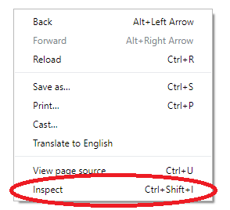
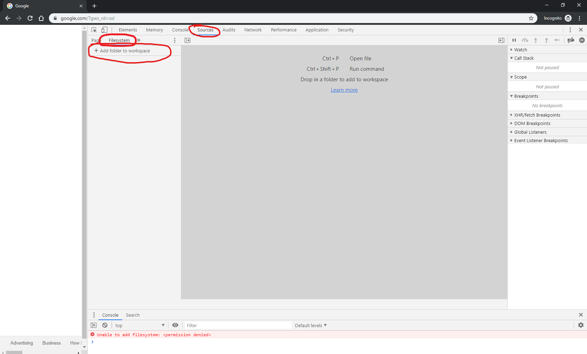
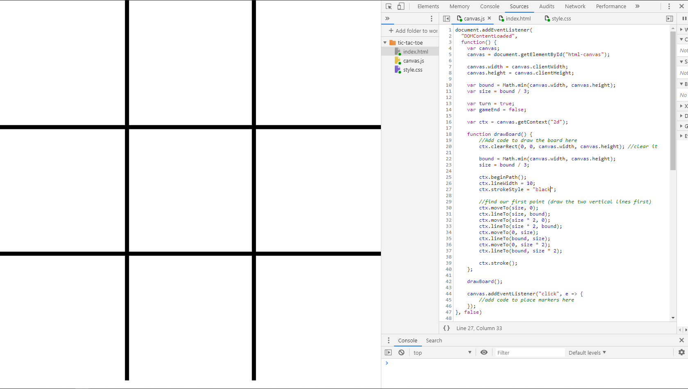
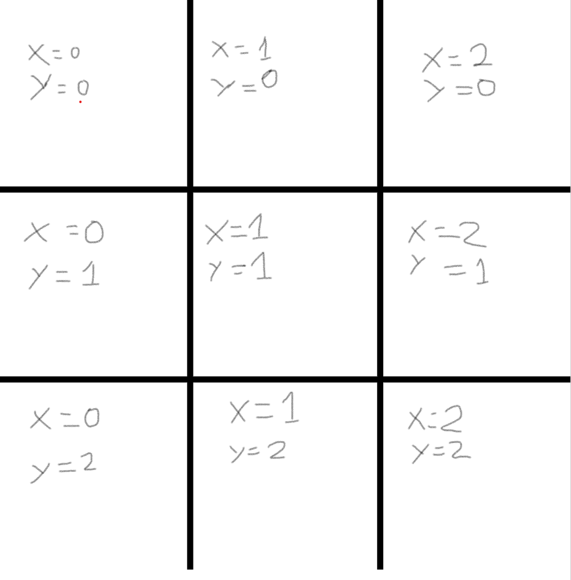
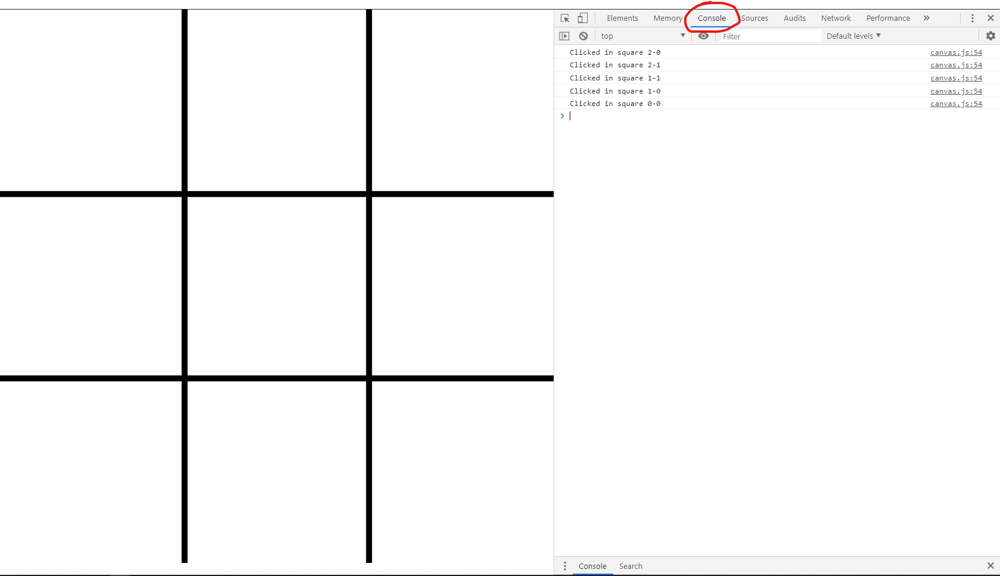
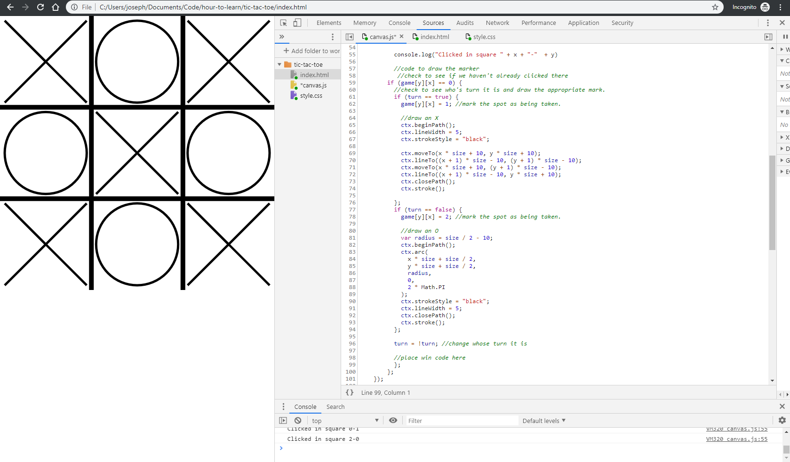

# Introduction 

Today we're going to program a very simple game of tic-tac-toe. You can play a sample of what we'll be doing [here](https://github.com/xuther/xuther.github.io/blob/master/instructions.md).

We're programming in the Javascript language, using a technology called HTML Canvas. 

We'll be moving fast, and glossing over a lot of things in an attempt to get something working in the hour we have. If you have questions about details, feel free to ask! The goal is to give you a feel for what programming is like. 

# Setup

Download the files you'll need from [Here](https://github.com/xuther/xuther.github.io/releases/download/1.0/tic-tac-toe.zip), if you can't get to those, we'll have a flash drive coming around. 

Unzip the files, and note where they are. They're probably in your `Downloads` folder. Next you'll need to open Chrome. Right click anywhere on the page and select the `Inspect` option. 



The tool that opens is called the Chrome Inspector, or Chrome Dev tools. Usually when programming you use what's called an IDE - integrated development environment - or a text editor like vim or VS Code to write your code. However for simple projects Chrome can act as a simple Javascript IDE. 

To set chrome up to get yourself started You'll want to navigate to the `Sources` tab in the Chrome Dev tools select `Filesystem` from the top of the bar on the left, and then click on the `Add folder to workspace` option.



Once here, you'll want to navigate to the folder you downloaded and unzipped before. It's probably called `tic-tac-toe`, assuming you haven't renamed anything. 

You'll see a bar at the top of Chrome asking for permission to access the folder - click `Allow` and you should see a folder in the sources window. If you expand it you should see three files - `index.html`, `canvas.js`, `style.css`.

Now click on the `index.html` file in the bar and drag it out to your browser, you should see something like `/C:/Users/joseph/Documents/Code/hour-to-learn/tic-tac-toe/index.html` in the address bar. If you see that you're good. 

Modern web programming usually has three main aspects, `HTML` files provide the structure of a webpage, usually what content is actually there. `CSS` files provide information about how that webpage should look - it's style. `JS` files contain all the code that your browser runs to make webpages interactive and dynamic. 

You're welcome to peek in the `index.html` and `style.css` files. We're starting with some basic HTML and CSS to get things started, and this project won't require too much. So we'll be focused on the `canvas.js` file. 

Let's get going. 

# Groundwork

First we need to break down the tasks we need to do to get a game of Tic-Tac-Toe playable in a browser. A good portion of programming is taking a task, and defining it in small, precise chunks. 

Tic-tac-toe is a simple game - X's and O's take turn placing markers in a 3x3 grid, X's going first. If any player get's three in a row, they win. If all the spots are taken, it's a draw. 

We can break the things we need to do into 6 basic steps. 

1) Draw a 3x3 grid as the board
2) Place an X or O marker when a user clicks on an empty square
3) Have our users take turns
4) Know when a player wins and display some sort of message
5) Know when a draw occurs and display some sort of message
6) Reset the board to play again

# Intro to the Code

In your window, open the `canvas.js` file. You should see the following code in there. 

```
document.addEventListener(
  "DOMContentLoaded",
  function() {
    var canvas;
    canvas = document.getElementById("html-canvas");

    canvas.width = canvas.clientWidth;
    canvas.height = canvas.clientHeight; 

    var game = [[0, 0, 0], [0, 0, 0], [0, 0, 0]];
    var bound = Math.min(canvas.width, canvas.height);
    var size = bound / 3;

    var turn = true;
    var gameEnd = false;

    var ctx = canvas.getContext("2d");
    
    function drawBoard() {
        //Add code to draw the board here
    };

    drawBoard();

    canvas.addEventListener("click", e => {
        //add on click code here
    });

    function drawText(text) {
        ctx.clearRect(0, 0, canvas.width, canvas.height); //clear it
        fontsize = 800;
        ctx.font = fontsize + "px Arial";
        while (ctx.measureText(text).width > bound - 10) {
          fontsize -= 100;
          ctx.font = fontsize + "px Arial";
        }
        ctx.fillText(text, 5, bound / 2);
        gameEnd = true;
    }
}, false)

function checkWin(board) {
    //add code to check if the game is over here 
};

```

Computers read code from the top down, merely executing the instructions they're told to. The formal rules about what those instructions have to look like for the computer to understand them is called 'syntax'. Each language has it's own sytax. We're looking at Javascript code here.

You don't need to worry about the majority of this code, there's a lot to wait for the page to finish loading and then prepare the the page for us to draw on. But there are a few concepts here that we'll use throughout, so I'll explain them briefly, but keep in mind that we're moving fast, and I'll have to gloss over a lot of things, a lot of this probably won't make sense right off the bat. That's OK. In fact, feel free to skip to the next header if you just want to get to coding. 

```
var canvas
```
This line is what we call a *variable declaration*. In programming a variable is just a value that can change, we give that value a name - in this case `canvas` - so we can tell the computer to access it. 

```
canvas = document.getElementById("html-canvas")
``` 
On this line there's a lot going on. 

The stuff on the right of the equals sign - `document.getElementById("html-canvas")` - is a *function call*. Functions in programming are ways to group instructions for the computer. All this says is "there are a bunch of instructions out there, you know how to get to them if I tell you `document.getElementById("html-canvas")` - go do that, and bring back whatever it tells you. This particular function 'gets' our canvas - which we'll be drawing on later. 

In mathematics we're used to the `=` sign meaning equivalence, i.e. `1 + 2 = 3`. In javascript a single `=` sign is an `assignment` operator, basically it's saying "Take whatever is on the right - in this case the stuff `document.getElementById("html-canvas")` brings back -  and store it in the *variable* on the left - `canvas`".

That was a lot. Again, don't sweat getting all of it. 

Let's see what we need to do to draw the board

## Draw the board

we're going to write some code to draw the board on the screen. 

Find in the code the line that says `//Add code to draw the board here`, replace it with the following code. 

```
        ctx.clearRect(0, 0, canvas.width, canvas.height); //clear the board
        game = [[0, 0, 0], [0, 0, 0], [0, 0, 0]];
        turn = true;
        gameEnd = false;

        bound = Math.min(canvas.width, canvas.height);
        size = bound / 3;
  
        ctx.beginPath();
        ctx.lineWidth = 10;
        ctx.strokeStyle = "black";
  
        //find our first point (draw the two vertical lines first)
        ctx.moveTo(size, 0);
        ctx.lineTo(size, bound);
        ctx.moveTo(size * 2, 0);
        ctx.lineTo(size * 2, bound);
        ctx.moveTo(0, size);
        ctx.lineTo(bound, size);
        ctx.moveTo(0, size * 2);
        ctx.lineTo(bound, size * 2);
  
        ctx.stroke();
```

Let's walk though allZ of that

```
        ctx.clearRect(0, 0, canvas.width, canvas.height); //clear the board
        game = [[0, 0, 0], [0, 0, 0], [0, 0, 0]];
        turn = true;
        gameEnd = false;
```
This clears whatever might be on the screen right now and resets some games state. This will be important later when we're resetting the game board between games. 

```
        bound = Math.min(canvas.width, canvas.height);
```
This line just finds out if the window is wider or taller, it takes which is smaller and stores it in the variable called `bound`. 

```
        size = bound / 3;
```
This line tells us how big each of the 9 squares on our board will be. 1/3 of the size of the total board. 

```
        ctx.beginPath();
```
This line is how we tell the computer that we're going to draw a set of lines, and we'll draw them a certain way. 

```
        ctx.lineWidth = 10;
        ctx.strokeStyle = "black";
```
These two lines tell the computer how we want to draw our lines. Specifically how wide we want it and what color we want it. 

```
        //Draw the veritcal lines
        ctx.moveTo(size, 0);
        ctx.lineTo(size, bound);
        ctx.moveTo(size * 2, 0);
        ctx.lineTo(size * 2, bound);

        //Draw the Horizontal lines
        ctx.moveTo(0, size);
        ctx.lineTo(bound, size);
        ctx.moveTo(0, size * 2);
        ctx.lineTo(bound, size * 2);
```

All of these lines tell the computer where to draw the lines. On a canvas you can think of drawing like moving a pen around. We tell the computer where to position the pen, and then where to draw a line to. You'll notice that we use the `size` and `bound` variables here.

`ctx.stroke();` - this line says that we're done with this set of lines, go ahead and draw them now. 

Once you've copied the code into your window save it (press control + s on your keyboard) and refresh your webpage. You should see the board show up! Try changing the line width and colors and refreshing, you should see your changes on the screen. 



There are a lot of colors you can use - `green`, `red`, `teal`, `indianred`, `orchid` - you can see the full list of them [here](https://developer.mozilla.org/en-US/docs/Web/CSS/color_value#Color_keywords).

## Sensing Clicks 

We've drawn the board, but if we click on it nothing happens. We have to tell Chrome what we want it to do when it detects that someone clicks on the screen. The code in the file that looks like 

```
    canvas.addEventListener("click", e => {
        //add on click code here
    });
```

Tells chrome "When someone clicks, run this code". We'll add our code to place markers here. 

The first thing we need to do when we know someone clicked on the board is find out which square they clicked on. The computer doesn't know that there are squares here, all it knows is that we drew some lines. Fortunately we can ask where the user clicked on the screen and do some math to figure out which box the user clicked on. 

Copy the code below to the line that says `//add on click code here`. 

```
        //game end code here 

        var xcoords = e.clientX;
        var ycoords = e.clientY;
  
        //check to see if we're in our tic-tac-toe box.
        if (xcoords > 0 && xcoords < bound && ycoords > 0 && ycoords < bound) {
          //we're in the bound, check to see what square we're in
          x = Math.floor(xcoords / size);
          y = Math.floor(ycoords / size);

          console.log("Clicked in square " + x + "-"  + y)

          //code to draw the marker
        } 
```

There are some comments (lines that start with `//`) where we'll put some code later, but let's walk through this. 

```
        var xcoords = e.clientX;
        var ycoords = e.clientY;
```
These lines ask where the user clicked and store the coordinates (address) in the variables `xcoords` and `ycoords`. 

```
        if (xcoords > 0 && xcoords < bound && ycoords > 0 && ycoords < bound) {
```
This line is an *if statement* - basically it says "If these things in the parenthesis are true, run the code in the squigly brackets". In this case it's checking to see if they clicked anywhere on our tic-tac-toe board. 

```
          x = Math.floor(x / size);
          y = Math.floor(y / size);
```
These lines get which of the boxes the coordinates fall into and stores them in the variables `x` and `y`. We've given each of the boxes an address (their coordinates).



```
console.log("Clicked in square " + xsquare + "-"  + ysquare)
```
This line will print out in our console which square the user clicked on. 

Once you've copied the above code, save it, refresh your page, and then click on the `Console` tab of your Chrome Developer Tools. Now click around on your tic-tac-toe board. you should see some things print out depending on where you click. 



Now head back to the `Sources` tab. 

## Drawing markers

Now we know what box they clicked on, now we need to draw some markers. There's a lot of code here, but it's similar to stuff we've seen before. Copy the following code to the spot that says `//code to draw the marker`.

```
        //check to see if we haven't already clicked there
        if (game[y][x] == 0) {
          //check to see who's turn it is and draw the appropriate mark.
          if (turn == true) {
            game[y][x] = 1; //mark the spot as being taken. 

            //draw an X
            ctx.beginPath();
            ctx.lineWidth = 5;
            ctx.strokeStyle = "black";

            ctx.moveTo(x * size + 10, y * size + 10);
            ctx.lineTo((x + 1) * size - 10, (y + 1) * size - 10);
            ctx.moveTo(x * size + 10, (y + 1) * size - 10);
            ctx.lineTo((x + 1) * size - 10, y * size + 10);
            ctx.closePath();
            ctx.stroke();

          };
          if (turn == false) {
            game[y][x] = 2; //mark the spot as being taken.

            //draw an O
            var radius = size / 2 - 10;
            ctx.beginPath();
            ctx.arc(
              x * size + size / 2,
              y * size + size / 2,
              radius,
              0,
              2 * Math.PI
            );
            ctx.strokeStyle = "black";
            ctx.lineWidth = 5;
            ctx.closePath();
            ctx.stroke();
          };

          turn = !turn; //change whose turn it is
          
          //place win code here
        };
```

Let's look at each piece. 

```
        if (game[y][x] == 0) {
```
We're using a variable called `game` to keep track of what squares have what in them, 0 means nothing, 1 means and 'x' and 2 means an 'o'. We're checking to see if the square that was clicked on already has something in it. If it doesn't we'll draw something. 

```
            if (turn) {
```
We're using a variable called `turn` to keep track of whose turn it is. `turn` is what we call a *boolean* variable, which just means it can be either true or false. If it's true, it's X's turn, if false, it's O's. 

```
game[y][x] = 1; //mark the spot as being taken.
```
This line just marks in our `game` variable that X has drawn a mark in the square that was just clicked on. 

```
            //draw an X
            ctx.beginPath();
            ctx.lineWidth = 5;
            ctx.strokeStyle = "black";

            ctx.moveTo(x * size + 10, y * size + 10);
            ctx.lineTo((x + 1) * size - 10, (y + 1) * size - 10);
            ctx.moveTo(x * size + 10, (y + 1) * size - 10);
            ctx.lineTo((x + 1) * size - 10, y * size + 10);
            ctx.closePath();
            ctx.stroke();
```
This all looks an awful lot like what we did when we drew the game board. It's the same concept. In this case we're drawing an 'X' in the square the user clicked on. 

```
          if (turn == false) {
            game[y][x] = 2; //mark the spot as being taken.

            //draw an O
            var radius = size / 2 - 10;
            ctx.beginPath();
            ctx.arc(
              x * size + size / 2,
              y * size + size / 2,
              radius,
              0,
              2 * Math.PI
            );
            ctx.strokeStyle = "black";
            ctx.lineWidth = 5;
            ctx.closePath();
            ctx.stroke();
          };
```
This is basically the exact same, just for if it's the 'O' player's turn. And rather than an X, we're drawing an O in the square. 

```
          turn = !turn; //change whose turn it is
```
As the comment explains, this line just changes whose turn it is after drawing the mark, from X to O and back again. 

Once you've added that code, saved, and refreshed, as you click on your board, you should see X's and O's appear!



## Winning the game

Ok, so we can place markers, but when the board is full or we get three in the a row, nothing happens. We need to tell the computer how to check for a win or draw. 

You'll notice at the bottom of the file that there are a few lines that look like this

```
function checkWin(board) {
    //add code to check if the game is over here 
};
```

This is a _function declaration_. We touched on functions above, but all it is is a way to package up a set of instructions so we can reference them by name. Similar to how we can say "Make me a PB & J sandwich" and we mean "go get some bread, peanut butter, and jam. Spread the peanut butter and jam on the bread and then bring it to me". That's a lot to say every time we want a sandwich, so we just say "make me a sandwich".

Take the code below and place it where it says `//add code to check if game is over here`. 

```
   var endcount = 0;
  //check win/end conditions
  for (var i = 0; i < 3; i++) {
    //check column
    if (
      board[i][0] != 0 && //has someone played in this square. 
      board[i][1] == board[i][0] && // has the same person played in all the other squares in the column? 
      board[i][2] == board[i][0]
    ) {
      return board[i][0];
    }
    //check row
    if (
      board[0][i] != 0 &&
      board[1][i] == board[0][i] &&
      board[2][i] == board[0][i]
    ) {
      return board[0][i];
    }
    //check how many suqares in column have a mark
    for (var j = 0; j < 3; j++) {
      if (board[i][j] != 0) {
        endcount++;
      }
    }
  }
  //check our diagonals
  if (
    board[0][0] != 0 &&
    board[1][1] == board[0][0] &&
    board[2][2] == board[0][0]
  ) {
    return board[1][1];
  }
  if (
    board[0][2] != 0 &&
    board[1][1] == board[0][2] &&
    board[2][0] == board[0][2]
  ) {
    return board[1][1];
  }

  //check for draw
  if (endcount == 9) {
    return 3;
  }

  return 0; //keep going
  ```

  Again, there's a lot there - so let's walk through it. 

  ```
  var endcount = 0;
  ```

  This should look familiar, we're declaring a new variable `endcount` and giving it the value of `0`. 

    ```
        for (var i = 0; i < 3; i++) {
    ```
This is the start of a _for loop_ - don't worry too much about this. In a nut shell it will run all the stuff in the curly brackets (`{}`) a certain number of times (3, in this case), adding one to the variable `i` each time. 

```
//check column
    if (
      board[i][0] != 0 && //has someone played in this square. 
      board[i][1] == board[i][0] && // has the same person played in all the other squares in the column? 
      board[i][2] == board[i][0]
    ) {
      return board[i][0];
    }
```

Another if check to see if someone has a mark in all three spots in the column. Notice the use of the `i` variable. each time through the loop it'll check a different column.

```
    //check row
    if (
      board[0][i] != 0 &&
      board[1][i] == board[0][i] &&
      board[2][i] == board[0][i]
    ) {
      return board[0][i];
    }
```
Same thing, just with the rows. 

you'll notice that if the check is successful, we `return` a value. This is how we tell someone who asked the function who the winner is (if there is one). Similar to how if you ask someone to make you a sandwich, you'd expect them to bring you a sandwich. 

```
    //check how many suqares in column have a mark
    for (var j = 0; j < 3; j++) {
      if (board[i][j] != 0) {
        endcount++;
      }
    }
```

This starts adding up how many squares have been played. If all 9 have a mark, and no one has 3 in a row, we know it's a draw - we use that `endcount` later. 

That brings us to the end of the for loop, but there's one more special case. The diagonals. 

```
//check our diagonals
  if (
    board[0][0] != 0 &&
    board[1][1] == board[0][0] &&
    board[2][2] == board[0][0]
  ) {
    return board[1][1];
  }
  if (
    board[0][2] != 0 &&
    board[1][1] == board[0][2] &&
    board[2][0] == board[0][2]
  ) {
    return board[1][1];
  }
  ```

Now we check for a draw

```
  //check for draw
  if (endcount == 9) {
    return 3;
  }
```

And if the game isn't over (no one has won and it's not a draw) - we tell whoever asked to keep going. 

```
  return 0; //keep going
```

## Caling a function

Ok, so we know how to tell if there's a winner, but we have to tell the computer to check after each move. 

Add the following code where it says `//place win code here`

```
          var winner  = checkWin(game) //ask our function if someone has won
          if (winner == 1) {
            drawText("X's win!");
          }
          if (winner ==2) {
            drawText("O's win!");
          }
          if (winner == 3) {
            drawText("Draw");
          }
```

So we first ask our function if someone has won the game. It will give us a different number depending on if the games over or not and who has won. 

0 = no winner, keep going
1 = X's win
2 = O's win
3 = Draw game

We check each of those cases, and we ask another function, `draw text` to draw some words on the page depending on the case. Feel free to change the words inside of each of the `"` to say whatever you'd like. It'll show up in those cases. 

Once you've added the above code, saved, and refreshed, you should be able to play a game. Once one of the players has won you should see some words show up.

## Resetting the game 

Ok, so now you can play a full game, there's just one step left - resetting the game so we can play again. 

Remeber the `drawBoard` stuff we did before, we're gonna use that again. We need to tell the computer to, after we click on the win text, clear the screen and start over. 

Find where it says `//game end code here`, it should be right below the line `    canvas.addEventListener("click", e => {`. Add the following few lines there. 

```
      if (gameEnd) {
        drawBoard();
        return;
      }
```

In the `drawText` function we used before, we set a variable called `gameEnd` so we can check if the game is over. If it is, we tell the comptuer to redraw the board, and then don't do anything else until we click again. 

Save, refresh, and now you should be able to play as many games as you like!

# Wrap up

Nice job. We covered a lot REALLY fast. Hopefully you had some fun seeing how programs get written. 
